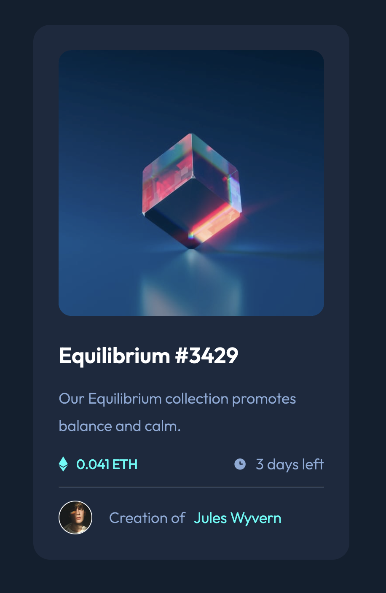
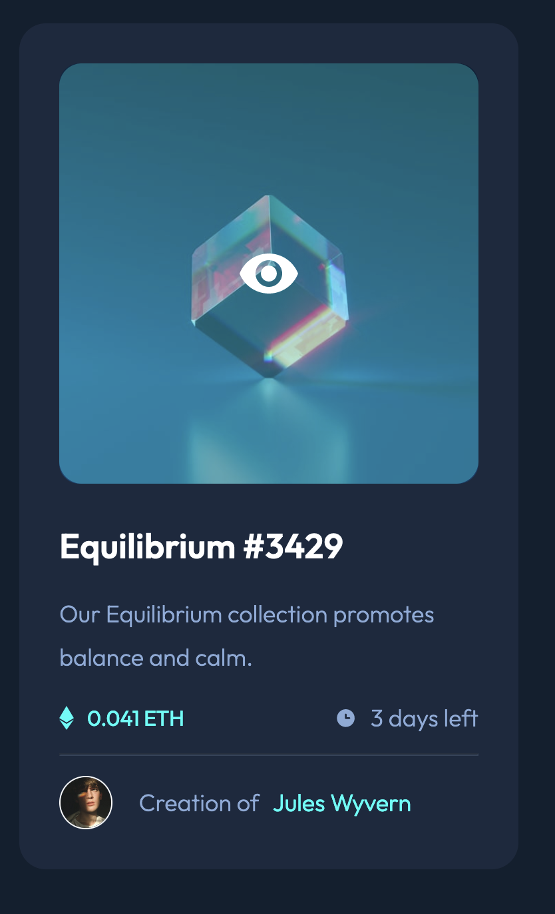

# Frontend Mentor - NFT preview card component solution

This is a solution to the [NFT preview card component challenge on Frontend Mentor](https://www.frontendmentor.io/challenges/nft-preview-card-component-SbdUL_w0U). 

## Table of contents

- [Overview](#overview)
  - [The challenge](#the-challenge)
- [Links](#links)
 - [Screenshot](#screenshot)
- [My process](#my-process)
  - [Built with](#built-with)
- [Author](#author)

## Overview

### The challenge

Users should be able to:

- View the optimal layout depending on their device's screen size
- See hover states for interactive elements

### Links

- [Live Project Preview](https://trent-townsend.github.io/NFT_preview_card/)
- Solution:
    - [HTML](https://github.com/trent-townsend/NFT_preview_card/blob/main/index.html)
    - [CSS](https://github.com/trent-townsend/NFT_preview_card/blob/main/styles.css)

### Screenshot
#### Screenshot of Completed Project

#### Screenshot of Animated Hover State

## My process

### Built with

- Semantic HTML5 markup
- CSS custom properties including:
    - hover pseudo-class
    - transition property
- Flexbox

## Author

- Website - [Trent Townsend](https://www.trenttownsend.com)
- Twitter - [@trent-townsend](https://www.twitter.com/trent-townsend)
